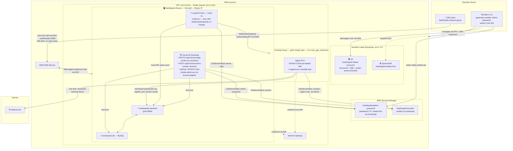

```mermaid
graph TB
    subgraph OPS["Operator (local)"]
        TF["Terraform CLI<br/>generates random admin password,<br/>seeds it into SM"]
        Users["👥 IAM users<br/>hashtopolis-viewers group"]
    end

    subgraph AWS["AWS account"]
        subgraph STATE["Terraform state (bootstrap, not in TF)"]
            S3["🪣 S3<br/>hashtopolis-tfstate-&lt;account&gt;<br/>versioned + SSE + public-access blocked"]
            DDB["🔒 DynamoDB<br/>hashtopolis-tfstate-lock"]
        end

        subgraph SECRETS["AWS Secrets Manager"]
            SMpw["hashtopolis/admin-password<br/>(seeded by TF, rotated live by bootstrap)"]
            SMvoucher["hashtopolis/voucher<br/>(written by bootstrap)"]
        end

        SSMService["AWS SSM Service"]

        subgraph VPC["VPC 10.0.0.0/16 — Public Subnet 10.0.1.0/24"]
            IGW["Internet Gateway"]

            subgraph ServerEC2["🖥 Hashtopolis Server — t3.small — Elastic IP"]
                Backend["🐳 hashtopolis-backend (port 8080)"]
                DB["🐳 hashtopolis-db — MySQL"]
                Bootstrap["🛠 cloud-init bootstrap<br/>• PATCH /api/v2/ui/configs (multi-use vouchers)<br/>• POST /api/v2/ui/vouchers (create voucher)<br/>• MySQL UPDATE User (rotate admin pw via bcrypt+pepper)"]
                Scaler["⏱ systemd timer — every 3s<br/>scaler.py — only calls SetDesiredCapacity on change"]
                Backend <--> DB
                Bootstrap -->|"first boot"| Backend
                Bootstrap -->|"first boot"| DB
                Scaler -->|"local API: tasks count"| Backend
            end

            subgraph ASG["Auto Scaling Group — g4dn.xlarge spot — 0 to max_gpu_instances"]
                Agent["Agent EC2<br/>NVIDIA CUDA pre-baked AMI<br/>2 agents per runnable task"]
            end
        end
    end

    subgraph EXT["Internet"]
        HashcatNet["🌐 hashcat.net"]
    end

    TF -->|"plan/apply, lock via DDB"| S3
    TF -.->|"acquires lock"| DDB
    TF -->|"writes initial random pw"| SMpw
    TF -->|"manages all VPC + IAM resources"| AWS

    Users -->|"aws ssm start-session<br/>--portNumber 8080<br/>IAM auth, no open ports"| SSMService
    SSMService <-->|"SSM agent (outbound only via EIP)"| ServerEC2

    Bootstrap -->|"GetSecretValue admin-password"| SMpw
    Bootstrap -->|"PutSecretValue voucher"| SMvoucher
    Scaler -->|"GetSecretValue (server role)"| SMpw
    Scaler -->|"SetDesiredCapacity (autoscaling API via IGW)"| ASG

    Agent -->|"GetSecretValue voucher (agent role, via boto3)"| SMvoucher
    Agent -->|"download hashtopolis.zip,<br/>register, poll, stream results"| Backend
    Agent -->|"one-time: download hashcat binary"| HashcatNet
    Agent -.->|"outbound via IGW"| IGW
    ServerEC2 -.->|"outbound via EIP"| IGW
```
