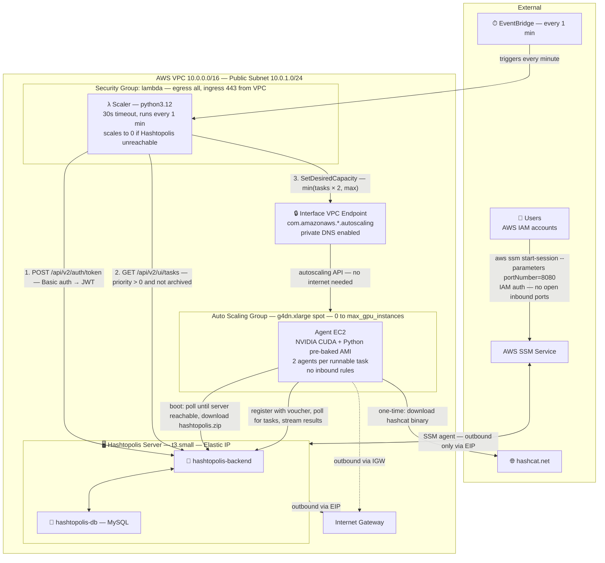

```mermaid
graph TB
    subgraph EXT["External"]
        Users["👥 Users<br/>AWS IAM accounts"]
        HashcatNet["🌐 hashcat.net"]
        EventBridge["⏱ EventBridge — every 1 min"]
        SSMService["AWS SSM Service"]
    end

    subgraph VPC["AWS VPC 10.0.0.0/16 — Public Subnet 10.0.1.0/24"]
        IGW["Internet Gateway"]

        subgraph ServerEC2["🖥 Hashtopolis Server — t3.small — Elastic IP"]
            Backend["🐳 hashtopolis-backend"]
            DB["🐳 hashtopolis-db — MySQL"]
            Backend <--> DB
        end

        subgraph ASG["Auto Scaling Group — g4dn.xlarge spot — 0 to max_gpu_instances"]
            Agent["Agent EC2<br/>NVIDIA CUDA + Python pre-baked AMI<br/>2 agents per runnable task<br/>no inbound rules"]
        end

        subgraph LambdaSG["Security Group: lambda — egress all, ingress 443 from VPC"]
            Lambda["λ Scaler — python3.12<br/>30s timeout, runs every 1 min<br/>scales to 0 if Hashtopolis unreachable"]
        end

        Endpoint["🔒 Interface VPC Endpoint<br/>com.amazonaws.*.autoscaling<br/>private DNS enabled"]
    end

    Users -->|"aws ssm start-session --parameters portNumber=8080<br/>IAM auth — no open inbound ports"| SSMService
    SSMService <-->|"SSM agent — outbound only via EIP"| ServerEC2

    EventBridge -->|"triggers every minute"| Lambda
    Lambda -->|"1. POST /api/v2/auth/token — Basic auth → JWT"| Backend
    Lambda -->|"2. GET /api/v2/ui/tasks — priority > 0 and not archived"| Backend
    Lambda -->|"3. SetDesiredCapacity — min(tasks × 2, max)"| Endpoint
    Endpoint -->|"autoscaling API — no internet needed"| ASG

    Agent -->|"boot: poll until server reachable, download hashtopolis.zip"| Backend
    Agent -->|"register with voucher, poll for tasks, stream results"| Backend
    Agent -->|"one-time: download hashcat binary"| HashcatNet
    Agent -.->|"outbound via IGW"| IGW
    ServerEC2 -.->|"outbound via EIP"| IGW
```
