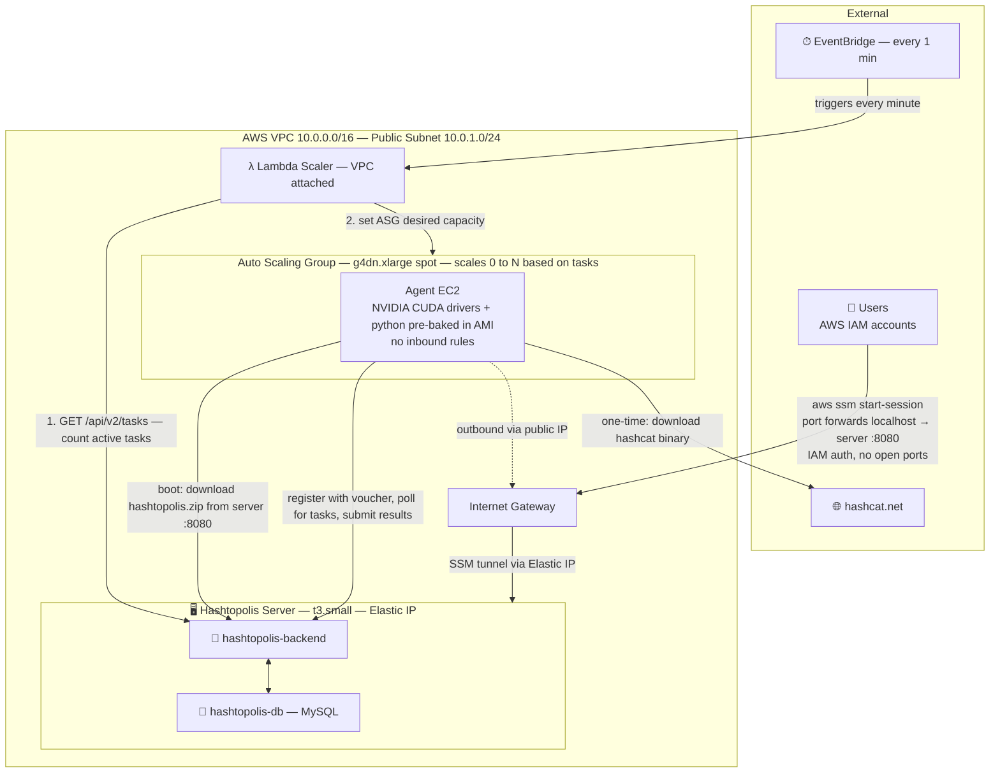

```mermaid
graph TB
    subgraph EXT["External"]
        Users["👥 Users<br/>AWS IAM accounts"]
        HashcatNet["🌐 hashcat.net"]
        EventBridge["⏱ EventBridge — every 1 min"]
    end

    subgraph VPC["AWS VPC 10.0.0.0/16 — Public Subnet 10.0.1.0/24"]
        IGW["Internet Gateway"]

        subgraph ServerEC2["🖥 Hashtopolis Server — t3.small — Elastic IP"]
            Backend["🐳 hashtopolis-backend"]
            DB["🐳 hashtopolis-db — MySQL"]
            Backend <--> DB
        end

        subgraph ASG["Auto Scaling Group — g4dn.xlarge spot — scales 0 to N based on tasks"]
            Agent["Agent EC2<br/>NVIDIA CUDA drivers + python pre-baked in AMI<br/>no inbound rules"]
        end

        Lambda["λ Lambda Scaler — VPC attached"]
    end

    Users -->|"aws ssm start-session<br/>port forwards localhost → server :8080<br/>IAM auth, no open ports"| IGW
    IGW -->|"SSM tunnel via Elastic IP"| ServerEC2

    EventBridge -->|"triggers every minute"| Lambda
    Lambda -->|"1. GET /api/v2/tasks — count active tasks"| Backend
    Lambda -->|"2. set ASG desired capacity"| ASG

    Agent -->|"boot: download hashtopolis.zip from server :8080"| Backend
    Agent -->|"register with voucher, poll for tasks, submit results"| Backend
    Agent -->|"one-time: download hashcat binary"| HashcatNet
    Agent -.->|"outbound via public IP"| IGW
```
